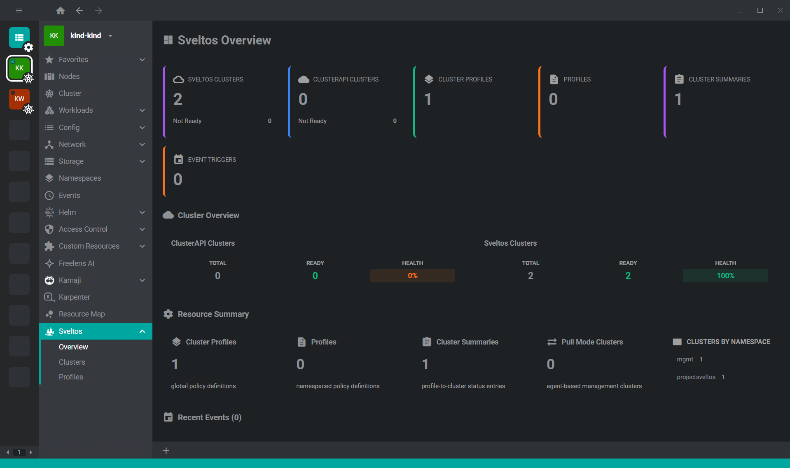
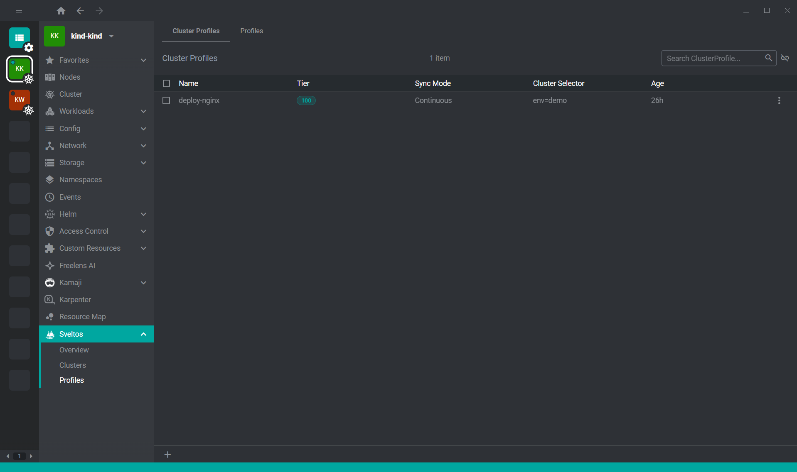

# @freelensapp/sveltos-extension

<!-- markdownlint-disable MD013 -->

[](https://freelens.app)
[](https://github.com/freelensapp/freelens-sveltos-extension)
[](https://github.com/freelensapp/freelens-sveltos-extension)
[](https://github.com/freelensapp/freelens-sveltos-extension/actions/workflows/integration-tests.yaml)
[](https://www.npmjs.com/package/@freelensapp/sveltos-extension)

<!-- markdownlint-enable MD013 -->

Freelens extension for [Sveltos](https://projectsveltos.github.io/sveltos/).

Manage Sveltos and ClusterAPI resources directly from your Freelens cluster
view: monitor managed clusters, inspect profiles and tier configuration,
and get a quick health overview of your fleet.

## Compatibility

This extension is intended for management clusters where the Sveltos CRDs
(and optionally ClusterAPI CRDs) are installed and available.

- Freelens >= 1.8.0 (declared in `engines.freelens`)
- A Kubernetes version compatible with your installed Sveltos release
  (refer to the [Sveltos compatibility matrix](https://projectsveltos.github.io/sveltos/))

> **Note**: Tested on kind. Feedback on other cluster types welcome.

## Features

The extension adds a dedicated **Sveltos** entry to the cluster sidebar
with three sub-pages and rich detail views for Sveltos custom resources.

### Overview



A dashboard summarizing the state of the Sveltos fleet on the management cluster:

- **Cluster counters** for Sveltos clusters and ClusterAPI clusters
  (total / ready / not ready)
- **Pull-mode clusters** indicator
- **Cluster Profiles / Profiles / Cluster Summaries / Event Triggers** counters
- **Cluster summary** breakdown by namespace
- **Helm releases summary** aggregated from `ClusterSummary` resources
- **Recent events** for Sveltos and ClusterAPI API groups
  (`config.projectsveltos.io`, `lib.projectsveltos.io`, `cluster.x-k8s.io`)

### Clusters


Two tabs to inspect every cluster managed by Sveltos:

- **Sveltos Clusters** (`SveltosCluster`): name, namespace, ready status,
  agent presence indicator, Kubernetes version, paused / pull-mode badges,
  age — sortable and searchable.
- **ClusterAPI Clusters** (`Cluster` from `cluster.x-k8s.io`): name,
  namespace, status (derived from `controlPlaneReady` / `phase`),
  phase, paused badge, age. When the ClusterAPI CRDs are not installed,
  an explanatory empty-state card is shown instead.

Status dots use a clear green / red / gray scheme for ready, not-ready,
and unknown states.

### Profiles



Two tabs to manage Sveltos configuration profiles:

- **Cluster Profiles** (`ClusterProfile`, cluster-scoped): name, tier,
  sync mode, cluster selector, age.
- **Profiles** (`Profile`, namespaced): name, namespace, tier, sync mode,
  cluster selector, age.

Each row is sortable and searchable, and the tier is highlighted with a
dedicated badge to make tier-based prioritization easy to spot. When the
CRDs are missing the page renders a helpful empty state.

### Sveltos resource details

The extension also registers details panels and a quick **Active toggle**
menu item for the legacy `Sveltos` CRD (`v1alpha1` and `v1alpha2`), so you
can enable or disable Sveltos features directly from the resource menu.

## Install

To install or upgrade: open Freelens and go to Extensions (`ctrl`+`shift`+`E`
or `cmd`+`shift`+`E`), and install `@freelensapp/sveltos-extension`.

or:

Use the following URL in the browser:
[freelens://app/extensions/install/%40freelensapp%2Fsveltos-extension](freelens://app/extensions/install/%40freelensapp%2Fsveltos-extension)

## Build from source

### Prerequisites

Use [NVM](https://github.com/nvm-sh/nvm) or
[mise-en-place](https://mise.jdx.dev/) or
[windows-nvm](https://github.com/coreybutler/nvm-windows) to install the
required Node.js version.

From the root of this repository:

```sh
nvm install
# or
mise install
# or
winget install CoreyButler.NVMforWindows
nvm install 22.22.1
nvm use 22.22.1
```

Install Pnpm:

```sh
corepack install
# or
curl -fsSL https://get.pnpm.io/install.sh | sh -
# or
winget install pnpm.pnpm
```

### Build extension

```sh
corepack pnpm i
corepack pnpm build
corepack pnpm pack
```

One script to build then pack the extension to test:

```sh
pnpm pack:dev
```

### Install built extension

The tarball for the extension will be placed in the current directory.

In Freelens, navigate to the Extensions list and provide the path to the tarball
to be loaded, or drag and drop the extension tarball into the Freelens window.
After loading for a moment, the extension should appear in the list of enabled
extensions.

## License

Copyright (c) 2025-2026 Freelens Authors.

[MIT License](https://opensource.org/licenses/MIT)
